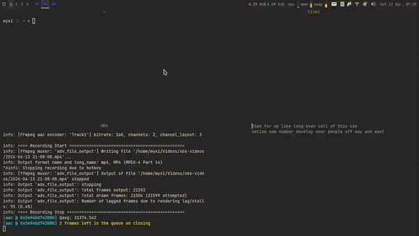

# Lismi

<p align="center">
    

A simple typing frontend for your terminal.

# State of the Project
This is in beta stage. The experience is not guaranteed to be stable.

# Features
- layout emulation
- color highlighting
- text alignment and text wrapping

# Installation
### First Method
```bash
git clone --depth 1 --branch main <REPO URL> lismi
pip install ./lismi
```
### Second Method
```bash
pip install git+<REPO URL>@main
```
# Tips
1. You can delete whole words with C-w (CTRL + w) or C-backspace key combination. C-w is
   not as universal as C-backspace, though.
1. You can reset a test using C-e key combination.
1. You can skip a test using the Esc key.
1. You can do `-p -W file.txt` or `-pW file.txt` to select a text file from the `words/`
   folder of this project. E.g., you can do `-pW ten-thousand.txt` to select the 10K
   word file from [here](src/lismi/words/ten-thousand.txt). Your current working directory (CWD)
   does not matter.
1. When the report card is shown, you can use backspace or C-W or C-backspace to go back
   and correct yourself somewhere in the test you just completed. Do note that that the
   time you spent reading the report card is accounted for calculating WPM.
1. You can use 
   [this script](https://gist.github.com/eeriemyxi/ec779ba75d1a6a807234d6cf2af480d5) to swap
   your keyboard layout per test. Similar to the Layoutfluid feature of MonkeyType.
1. You can do `lismi --help` for more tips. Thank you for using Lismi!

# Command-Line Arguments
```
usage: lismi [-h] [-w WORD_COUNT] [-W WORD_FILE] [-p] [-s] [-S]
                   [-t TARGET_LAYOUT] [-e EMULATE_LAYOUT] [-m MAX_SPACES] [-q]
                   [-V]

Lismi - A simple typing frontend for terminals.

options:
  -h, --help            show this help message and exit
  -w WORD_COUNT, --word-count WORD_COUNT
                        Number of words per test. Default: 20.
  -W WORD_FILE, --word-file WORD_FILE
                        Word file. Defaults (currently) to '/home/myxi/Documents
                        /coding/python/lismi/src/lismi/words/two-hundred.txt'.
  -p, --prepend-script-directory
                        Look for the word file in the script directory's
                        dedicated folder.
  -s, --skip-words      Space skips words.
  -S, --one-shot        Exit after first test.
  -t TARGET_LAYOUT, --target-layout TARGET_LAYOUT
                        Target layout. Default: 'qwerty'. Available: qwerty,
                        colemak.
  -e EMULATE_LAYOUT, --emulate-layout EMULATE_LAYOUT
                        Emulate layout. Default: 'qwerty'. Available: qwerty,
                        colemak.
  -m MAX_SPACES, --max-spaces MAX_SPACES
                        Max spaces per line. Default: 10. Minimum: 2.
  -q, --no-quick-end    Disable quickly ending test by ignoring last space.
                        Default: True.
  -V, --version         Show program version.
```

